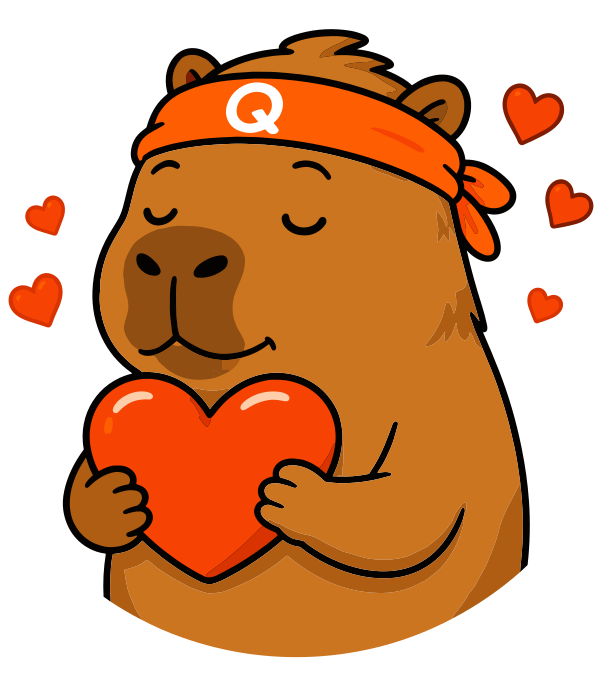

  

<h1 align="center">Hey, I'm Robin 👋</h1>

  <b>Self-taught iOS developer</b> — learning the craft by shipping real apps, not just tutorials 🚀

  
  
  
  
  

---

### 🧑‍💻 The journey so far

- 📱 Going from **zero → shipping** — I learn by building real iOS & **watchOS** apps people can actually use
- 🔥 Working across the whole stack: **Swift · SwiftUI · Firebase** (auth, Firestore, cloud functions)
- 🎮 Currently deep in habit-tracking, streaks, and gamification — making good habits stick
- 🧠 Every bug is a lesson, every shipped feature is a tiny win

### 🛠️ What I'm building

> A polished **iOS + watchOS accountability app** — streaks, rewards, and an in-app coin economy. 
> It's my playground for turning *"I'm learning Swift"* into *"I shipped this."* ☀️

---

<i>Building one commit at a time. 🛠️☀️</i>

